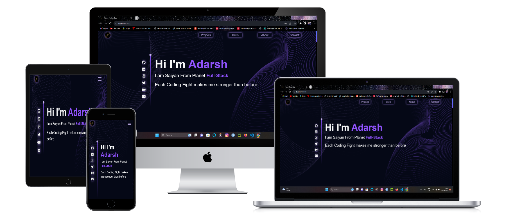
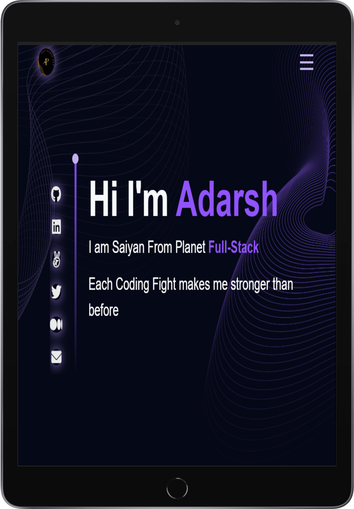
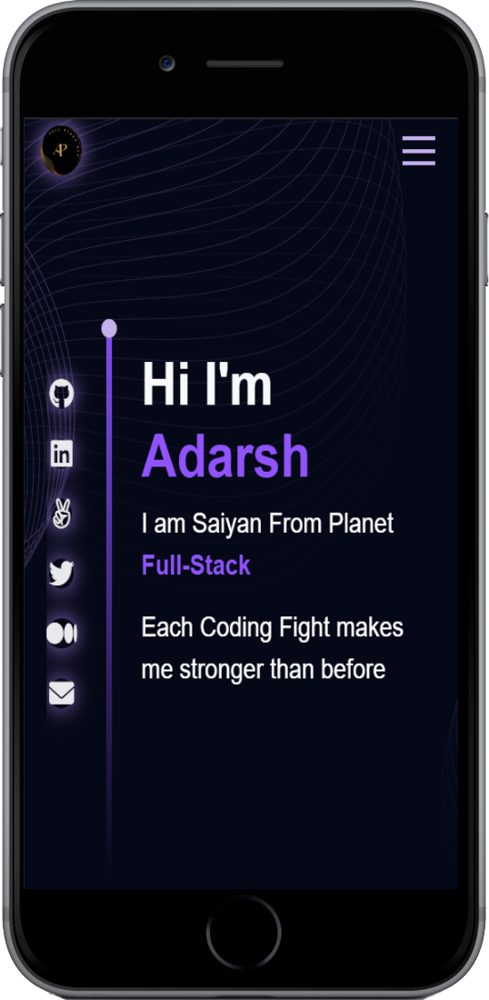

# 📗 Table of Contents
- [App Mock](#app-mock)
- [📖 About the Project](#about-project)
  - [🧪 Linters](#linters)
  - [🛠 Built With](#built-with)
    - [Tech Stack](#tech-stack)
    - [Key Features](#key-features)
  - [🚀 Live Demo](#live-demo)
- [💻 Getting Started](#getting-started)
  - [Setup](#setup)
  - [Prerequisites](#prerequisites)
  - [Install](#install)
  - [Usage](#usage)
  - [Run tests](#run-tests)
- [👥 Authors](#authors)
- [🚀 Presentation And Live Demo](#video-presentation-for-our-project)
- [🔭 Future Features](#future-features)
- [🤝 Contributing](#contributing)
- [⭐️ Show your support](#support)
- [🙏 Acknowledgements](#acknowledgements)
- [📝 License](#license)

<!-- PROJECT DESCRIPTION -->

#  App mock

  
  
  


# 📖 Full-Stack Portfolio <a name="about-project"></a>

*Full Stack Developer Portfolio*: Discover a compilation of my diverse full stack projects and technical expertise. From interactive front-end designs to robust back-end solutions, this portfolio highlights my journey in crafting dynamic web applications.

## 🧪 Linters <a name="linters"></a>
[](https://github.com/PowerLevel9000/full-stack-portfolio/actions/workflows/linters.yml)
[](https://app.netlify.com/sites/adarsh-powerlevel9000/deploys)

## 🛠 Built With <a name="built-with"></a>

### Tech Stack <a name="tech-stack"></a>

In this project we utilize our skills and knowledge to create this project

<details>
  <summary>Project language </summary>
  <ul>
    <li><a href="https://www.javascript.com/">JavaScript</a></li>
  </ul>
</details>

<details>
  <summary>FrameWork</summary>
  <ul>
    <li><a href="https://react.dev/">React</a></li>
  </ul>
</details>

<details>
  <summary>Styling</summary>
  <ul>
    <li><a href="postgresql.org/">Css</a></li>
    <li><a href="postgresql.org/">Styled Components</a></li>
  </ul>
</details>


<!-- Features -->

### Key Features <a name="key-features"></a>

- *Hero Page*
- *Carousel Skills*
- *Responsive*
- *Pop Ups*
- *Overlays*
- *Animations*

## 🚀 Live Demo <a name="live-demo"></a>

[](https://adarsh-powerlevel9000.netlify.app/)
<p align="right">(<a href="#readme-top">back to top</a>)</p>


<!-- GETTING STARTED -->

## 💻 Getting Started <a name="getting-started"></a>

To get a local copy up and running, follow these steps.

### Prerequisites

In order to run this project you need:

- Node installed in your machine
- Any integrated terminal like 
  - CMD `preferred`
  - Bash`preferred`
  - PowerShell
  - etc

### Setup

Clone this repository to your desired folder:

for cloning follow this steps
- go to green `code` button very top left corner of this Repository container
- copy your `SSH` or `https` file and clone it in your desired folder 
- or just download `ZIP` file

### Install

Install this project with:

for now you don't need any installation to run project if you already followed [Prerequisites](#prerequisites)

just few dependency packages 
```
npm install
```


### Usage

To run the project, execute the following command:

```
npm start // to start development server
npm run build // to build for productions
```


<p align="right">(<a href="#readme-top">back to top</a>)</p>

<!-- AUTHORS -->

## 👥 Authors <a name="authors"></a>

👤 *Adarsh Pathak*

- GitHub: [@PowerLevel9000](https://github.com/PowerLevel9000)
- Twitter: [@PowerLevel9002](https://twitter.com/PowerLevel9002)
- LinkedIn: [Adarsh pathak](https://linkedin.com/in/PowerLevel)
- GitUp Page: [Portfolio Page](https://powerlevel9000.github.io/portfolio-project/)

<p align="right">(<a href="#readme-top">back to top</a>)</p>


## 🔭 Future Features <a name="future-features"></a>

- [ ] *Routing And Detailed Various Section*
- [ ] *Better footer and Navigation*


<p align="right">(<a href="#readme-top">back to top</a>)</p>

<!-- CONTRIBUTING -->

## 🤝 Contributing <a name="contributing"></a>

Contributions, issues, and feature requests are welcome!

Feel free to check the [issues page](../../issues/).

<p align="right">(<a href="#readme-top">back to top</a>)</p>

<!-- SUPPORT -->

## ⭐️ Show your support <a name="support"></a>

If you like this project please give it star or buy a coffee for us

<p align="right">(<a href="#readme-top">back to top</a>)</p>

<!-- ACKNOWLEDGEMENTS -->

## 🙏 Acknowledgments <a name="acknowledgements"></a>


I would like to thank microverse for giving this opportunity to show up my skills
and Yt Video for designing elements

<p align="right">(<a href="#readme-top">back to top</a>)</p>


<!-- LICENSE -->

## 📝 License <a name="license"></a>

This project is [GENERAL PUBLIC LICENSE](./LICENSE) licensed.


<p align="right">(<a href="#readme-top">back to top</a>)</p>